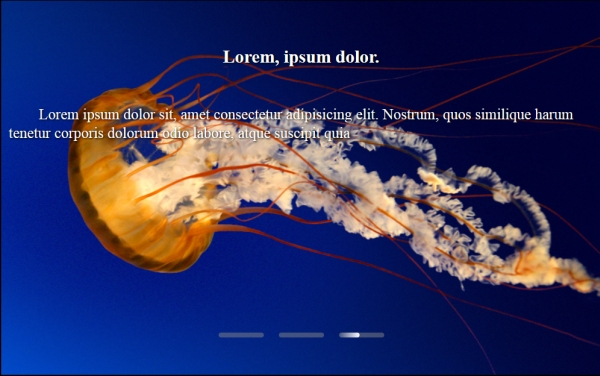

# Background-slider
Ссылка: https://alexaltrex.github.io/Background-slider

## Описание
Слайдер изображений с увеличивающимся задним фоном.

## Запуск проекта:
1. Клонирование и запуск: git clone https://github.com/Alexaltrex/Background-slider.git;
2. Переход в директорию с проектом: cd Background-slider;
3. Запуск файла index.html;

## Разработка
* Код - JS;
* Верстка - предпроцессор SASS (конкретно SCSS);
